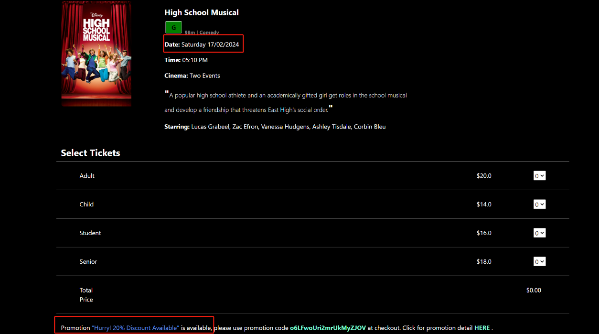

# MovieWeb
This is a group assignment. My role is UI&Frontend Developer

## Home page  
   

### Movies Showing Now and Coming Soon
From the navigation bar, select "Movies". This will provide movies that are showing now and coming soon  

## More Information
From "More" dropdown, Gift Shop, Giftcard Balance, Promotions, and Contact Us information is available  
  

### Gift Shop
Several types of gift cards are available from the gift shop, and balance can be checked without login   
 

   

Gift card can be printed to share with friends and family.  
 

### Promotions
Promotions information is available. And clicking "More" can see details of the promotion selected.   
 

## Booking
Tuesday daytime discount is available for all sessions playing between 7 am to 7 pm on Tuesday.  
 

Other discounts based on session date and time will be provided with a link to the promotion detail from the selecting tickets page.  

 

Promotion code and gift card code can be used at checkout.  
 

Tickets can be printed as pdfs  
 

## Customer Dashboard
In the customer dasbhoard, customers can view and edit their profile details, change password, view booking and giftcard purchase history, and print tickets and giftcards.  
 

## Staff Dashboard
In the staff dashboard, staff can also view and edit their profiles, check in customer, view movies, schedules, and promotions.  

Staff can select one of today's sessions to check customer in. If it is checked in by mistake, staff can always click "Not Checked" to reverse the transaction.  

## Manager Dashboard
Managers can view, edit, activate/deactivate customers/staff. They can manage movies and schedules, and search function is available.  
  

New sessions can be added to a movie by selecting a date range that the theatre would like to schedule the selected movie. Available sessions will be provided in a multi-selection dropdown.    

Managers can edit, enable or disable promotions. Add a promotion based on promotion types. "price" promotion will generate promotion code for movies showing on a specified date and time range. "other" promotions are non-price related promotions.  

Tickets can be added to the "price" promotion. Managers can either add all tickets or one ticket. Either discounted price or percentage discount can be selected for the ticket discount.   

Under "Reports", a highly-summarize overview over last 30 days will be provided.   

Reports for sales and customer breakdown are also available. They provide more details of sales and customer statistics.  

## Admin Dashboard 
Admin dashboard is similar to manage dashboard, but with more access. Admin can change the settings, edit ticket type, and change staff roles.  

Admin can change roles of staff and managers, which managers do not have access to.   

